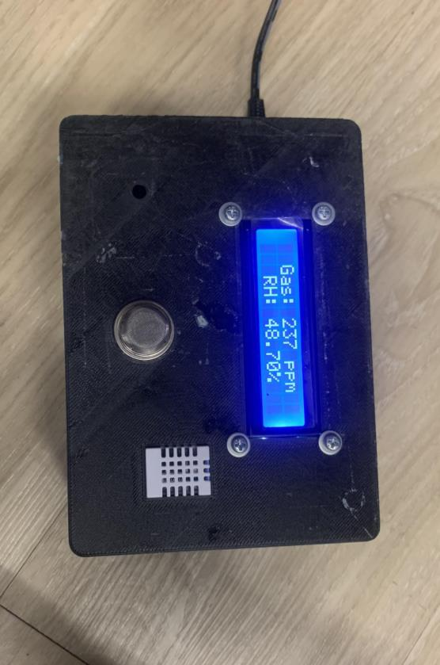
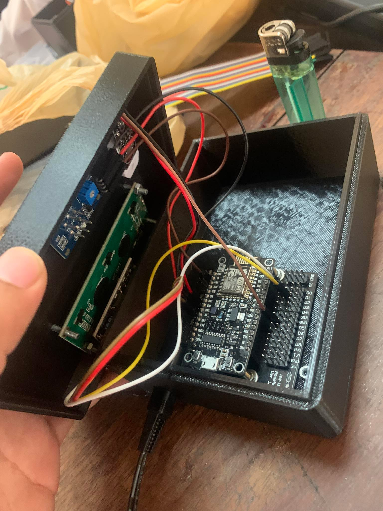
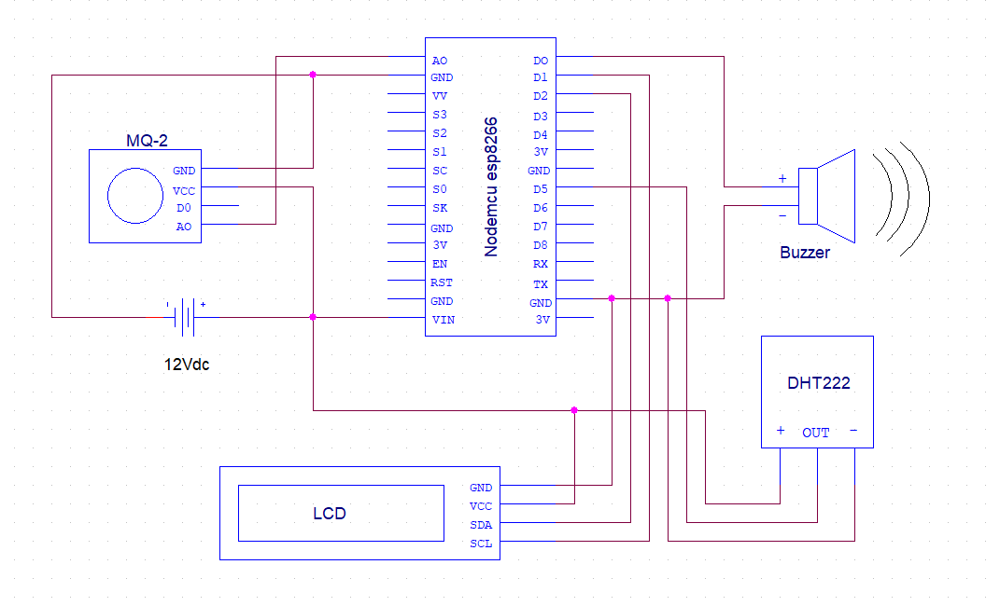
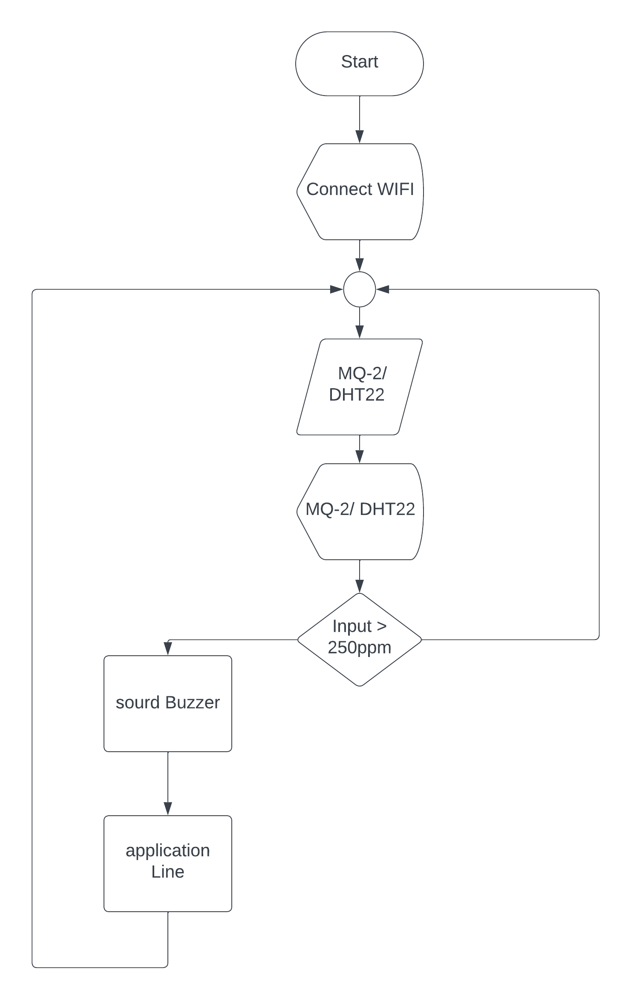
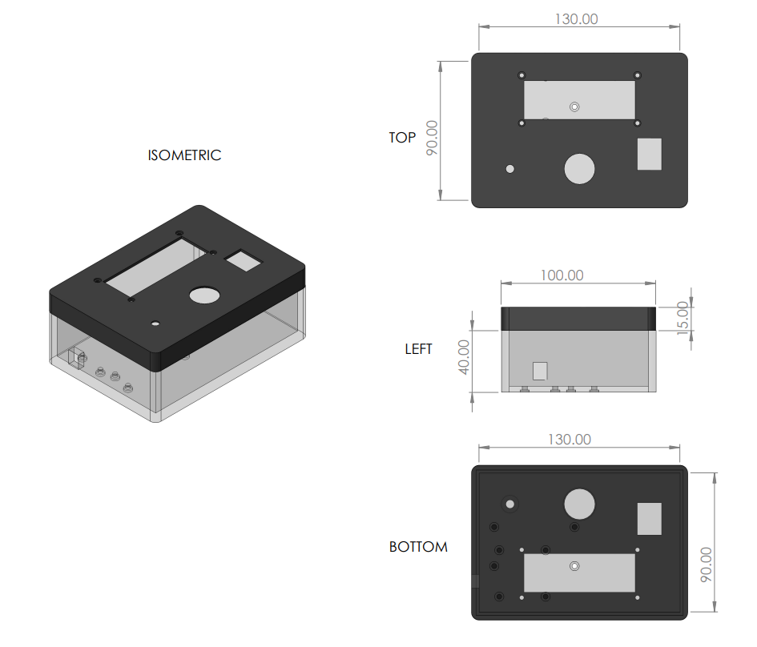
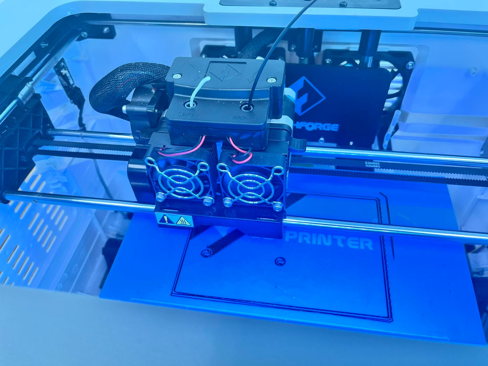

# IoT Bathroom Cigarette Smoke & Gas Detection System
### ระบบตรวจจับควันบุหรี่และก๊าซอันตรายในห้องน้ำด้วย NodeMCU ESP8266 พร้อมแจ้งเตือนผ่าน LINE Notify

<p align="left">
  
  
  
  
</p>

---

## ภาพรวมโครงงาน (Project Overview)

โครงงานพัฒนาอุปกรณ์ดักจับควันบุหรี่และก๊าซรั่วไหลภายในห้องน้ำสาธารณะของอาคารเรียน เพื่อป้องกันการแอบสูบบุหรี่ ลดความเสี่ยงในการเกิดอัคคีภัย และเสริมสร้างความปลอดภัยภายในตัวอาคาร 

ตัวเครื่องทำงานอัตโนมัติด้วยบอร์ดไมโครคอนโทรลเลอร์ **NodeMCU ESP8266** ร่วมกับเซ็นเซอร์วัดค่าก๊าซและควัน **MQ-2** และเซ็นเซอร์วัดอุณหภูมิความชื้นความแม่นยำสูง **DHT22** แสดงผลผ่านหน้าจอ **I2C LCD 1602** พร้อมลำโพงบัซเซอร์เตือนภัยในพื้นที่ และส่งการแจ้งเตือนแบบเรียลไทม์ผ่าน **LINE Notify API** เข้าสู่กลุ่มดูแลอาคารทันทีที่ระดับควันเกินค่าเกณฑ์มาตรฐาน (250 PPM) 

ตัวกล่องเคสอุปกรณ์ได้รับการออกแบบและขึ้นรูปด้วย **3D Printing (PLA Filament)** เพื่อความแข็งแรง ทนทาน และมีขนาดกะทัดรัดติดตั้งง่าย

---

## รูปภาพอุปกรณ์จริงและการประกอบ (Hardware Showcase)

<div align="center">
  <table align="center">
    <tr>
      <td align="center" width="400" valign="top">
        <br>
        
        <br><br>
        <b>ภาพตัวเครื่องจริงขณะทำงาน</b>
        <br>
        <sub>แสดงค่าก๊าซ 237 PPM และความชื้นสัมพัทธ์ 48.70% ผ่านจอ LCD</sub>
        <br><br>
      </td>
      <td align="center" width="400" valign="top">
        <br>
        
        <br><br>
        <b>การประกอบวงจรและทดสอบเซ็นเซอร์</b>
        <br>
        <sub>ทดสอบความไวการตอบสนองต่อแก๊สไฟแช็คและควันไฟภายในกล่องควบคุม</sub>
        <br><br>
      </td>
    </tr>
  </table>
</div>

---

## สถาปัตยกรรมระบบและแผนผังวงจร (Circuit & Architecture)

### 1. แผนผังการต่อวงจรอิเล็กทรอนิกส์ (Schematic Diagram)
อุปกรณ์ทั้งหมดรับแรงดันไฟฟ้ากระแสตรงผ่านอะแดปเตอร์ 12V DC เข้าบอร์ดขยาย NodeMCU Base Board และแปลงแรงดันป้อนเซ็นเซอร์และโมดูลต่าง ๆ อย่างเสถียร:

<div align="center">
  
</div>

<br>

### 2. ตารางการเชื่อมต่อขาอุปกรณ์ (Pin Assignment Table)

| อุปกรณ์ (Component) | ขาต่อไมโครคอนโทรลเลอร์ (ESP8266) | หน้าที่และรูปแบบสัญญาณ (Signal / Purpose) |
| :--- | :---: | :--- |
| **MQ-2 Gas & Smoke Sensor** | `A0` (Analog In) | ตรวจวัดความเข้มข้นควัน/ก๊าซไวไฟ (0 - 1023 -> แปลงหน่วย PPM) |
| **DHT22 Temperature & Humidity** | `D5` (GPIO 14) | อ่านค่าอุณหภูมิ (°C) และความชื้นสัมพัทธ์ (%RH) แบบดิจิทัล |
| **I2C LCD 1602 Display** | `D2` (SDA) / `D1` (SCL) | สื่อสารข้อมูลผ่าน I2C Bus Address `0x27` แสดงผลตัวอักษร 2 บรรทัด |
| **Active Buzzer** | `D0` (GPIO 16) | ส่งสัญญาณเสียงเตือนความถี่สูงเมื่อระดับควันเกินค่าเกณฑ์กำหนด |
| **Power Supply** | `VIN` / `5V` / `GND` | จ่ายพลังงานจากอะแดปเตอร์ 12V 2A ผ่านตัวควบคุมแรงดันบนบอร์ด |

<br>

### 3. แผนผังกระบวนการทำงานของระบบ (System Flowchart)

<div align="center">
  
</div>

---

## การออกแบบและผลิตตัวกล่องเคส (3D Enclosure Design)

ตัวกล่องเก็บอุปกรณ์ได้รับการออกแบบตามขนาดทางวิศวกรรม (กว้าง 90 mm x ยาว 130 mm x สูง 55 mm) เพื่อเจาะช่องระบายอากาศ ช่องหน้าจอ LCD และช่องติดตั้งเซ็นเซอร์ MQ-2 / DHT22 ให้พอดีและระบายความร้อนได้ดี จากนั้นทำการพิมพ์ชิ้นงาน 3 มิติด้วยเครื่อง **FlashForge 3D Printer**:

<div align="center">
  <table align="center">
    <tr>
      <td align="center" width="400" valign="top">
        <br>
        
        <br><br>
        <b>แบบจำลองมิติ CAD ทางวิศวกรรม</b>
        <br>
        <sub>Isometric, Top, Left, and Bottom Views (หน่วย mm)</sub>
        <br><br>
      </td>
      <td align="center" width="400" valign="top">
        <br>
        
        <br><br>
        <b>การขึ้นรูปชิ้นงานด้วย FlashForge 3D Printer</b>
        <br>
        <sub>พิมพ์ด้วยเส้นใยพลาสติก PLA ขนาด 1.75 mm</sub>
        <br><br>
      </td>
    </tr>
  </table>
</div>

---

## ผลการทดสอบประสิทธิภาพ (Experimental Results)

จากการทดสอบประสิทธิภาพการตรวจจับควันและก๊าซในระยะต่าง ๆ ภายในพื้นที่ปิดจำลอง:

| ชนิดของแหล่งกำเนิดควัน | ระยะทดสอบ | การตรวจจับ (อุณหภูมิ / ความชื้น) | เสียง Buzzer | การแจ้งเตือน LINE Notify |
| :--- | :---: | :---: | :---: | :---: |
| **แก๊สไฟแช็ค (LPG / Butane)** | 2 cm | 39°C / 49% RH | ดังต่อเนื่อง 3 วินาที | ส่งข้อความเตือนสำเร็จ |
| **แก๊สไฟแช็ค (LPG / Butane)** | 5 cm | 37°C / 48% RH | ไม่ส่งเสียง | ไม่แจ้งเตือน |
| **ควันบุหรี่ (Cigarette Smoke)** | 2 cm | 40°C / 50% RH | ดังต่อเนื่อง 3 วินาที | ส่งข้อความเตือนสำเร็จ |
| **ควันบุหรี่ (Cigarette Smoke)** | 5 cm | 43°C / 49% RH | ไม่ส่งเสียง | ไม่แจ้งเตือน |
| **ควันธูป (Incense Smoke)** | 2 cm | 36°C / 49% RH | ดังต่อเนื่อง 3 วินาที | ส่งข้อความเตือนสำเร็จ |
| **ควันธูป (Incense Smoke)** | 5 cm | 38°C / 50% RH | ดังต่อเนื่อง 3 วินาที | ส่งข้อความเตือนสำเร็จ |

*สรุปผล:* เซ็นเซอร์ MQ-2 สามารถตรวจจับอนุภาคควันบุหรี่และก๊าซได้อย่างมีประสิทธิภาพในสภาพแวดล้อมพื้นที่จำกัด เช่น ห้องน้ำ และระบบ LINE Notify สามารถส่งข้อมูลแจ้งเตือนไปยังผู้ดูแลได้ทันทีเมื่อเชื่อมต่อสัญญาณอินเทอร์เน็ต

---

## โครงสร้างโฟลเดอร์ (Repository Structure)

```text
IoT-Bathroom-Smoke-Detector/
├── src/
│   └── bathroom_smoke_detector.ino       # ซอร์สโค้ดหลัก Arduino C++
├── docs/
│   ├── images/                           # รูปภาพอุปกรณ์จริง แผนผัง และแบบ CAD
│   │   ├── assembled_device.jpg
│   │   ├── circuit_schematic.png
│   │   ├── circuit_assembly.jpg
│   │   ├── 3d_printer_fabrication.jpg
│   │   ├── cad_enclosure_dimensions.png
│   │   ├── system_flowchart.png
│   │   └── wire_diagram.jpg
│   └── Bathroom_Smoke_Detector_Report.pdf # เล่มรายงานฉบับสมบูรณ์ (PDF 42 หน้า)
├── .gitignore
└── README.md
```

---

## วิธีการติดตั้งและทดสอบ (Getting Started)

1. **ติดตั้ง Arduino IDE และ ESP8266 Board Package:**
   - เพิ่ม URL ใน Boards Manager: `http://arduino.esp8266.com/stable/package_esp8266com_index.json`
   - ติดตั้งบอร์ด `esp8266 by ESP8266 Community`
2. **ติดตั้งไลบรารีที่จำเป็น:**
   - `TridentTD_LineNotify`
   - `DHT sensor library` (Adafruit)
   - `LCD_I2C`
3. **กำหนดค่าการเชื่อมต่อในไฟล์ซอร์สโค้ด:**
   ```cpp
   #define WIFI_SSID       "ชื่อไวไฟของคุณ"
   #define WIFI_PASSWORD   "รหัสผ่านไวไฟ"
   #define LINE_TOKEN      "LINE_NOTIFY_TOKEN_ของคุณ"
   ```
4. **คอมไพล์และอัปโหลด:**
   - เลือกบอร์ด `NodeMCU 1.0 (ESP-12E Module)`
   - เลือกพอร์ต COM ที่เชื่อมต่อ และกด **Upload**

---

## ผู้จัดทำโครงงาน (Project Authors)

<div align="center">
  <table align="center">
    <tr>
      <td align="center" width="340" valign="top">
        <br>
        <a href="https://github.com/Akkaradet-Wong">
          
        </a>
        <br><br>
        <a href="https://github.com/Akkaradet-Wong">
          <strong>นายอัครเดช วงศ์บำราบ</strong>
        </a>
        <br>
        <sub>Akkaradet Wongbamrap</sub>
        <br>
        <small>รหัสประจำตัว: 66172110337-1</small>
        <br><br>
        <a href="https://github.com/Akkaradet-Wong">
          
        </a>
        <br><br>
      </td>
      <td align="center" width="340" valign="top">
        <br>
        <a href="https://github.com/Happym0sttt">
          
        </a>
        <br><br>
        <a href="https://github.com/Happym0sttt">
          <strong>นางสาวศุภิชญา ปิ่นสุวรรณแสง</strong>
        </a>
        <br>
        <sub>Suphitchaya Pinsuwansaeng</sub>
        <br>
        <small>รหัสประจำตัว: 66172110034-4</small>
        <br><br>
        <a href="https://github.com/Happym0sttt">
          
        </a>
        <br><br>
      </td>
    </tr>
    <tr>
      <td align="center" width="340" valign="top">
        <br>
        <a href="https://github.com/MIBVI">
          
        </a>
        <br><br>
        <a href="https://github.com/MIBVI">
          <strong>นายอัครเดช ศุภาโชคธราทรัพย์</strong>
        </a>
        <br>
        <sub>Akkharadech Suphachoktharasap</sub>
        <br>
        <small>รหัสประจำตัว: 66172110290-9</small>
        <br><br>
        <a href="https://github.com/MIBVI">
          
        </a>
        <br><br>
      </td>
      <td align="center" width="340" valign="top">
        <br>
        <a href="https://github.com/nattagrit">
          
        </a>
        <br><br>
        <a href="https://github.com/nattagrit">
          <strong>นายณัฐกฤตย์ เรืองมะเริง</strong>
        </a>
        <br>
        <sub>Nattagrit Rueangmaroeng</sub>
        <br>
        <small>รหัสประจำตัว: 66172110149-1</small>
        <br><br>
        <a href="https://github.com/nattagrit">
          
        </a>
        <br><br>
      </td>
    </tr>
  </table>

  <br>

  <p align="center">
    <b>สมาชิกร่วมโครงงาน:</b> นายนวดล ศรีขาว (รหัส 66172110221-4)<br>
    <b>อาจารย์ที่ปรึกษาโครงงาน:</b> อาจารย์ ชิติสรรค์ วิชิโต<br>
    <i>สาขาวิชาวิศวกรรมคอมพิวเตอร์ คณะวิศวกรรมศาสตร์และเทคโนโลยี มหาวิทยาลัยเทคโนโลยีราชมงคลอีสาน (ปีการศึกษา 2566)</i>
  </p>
</div>
